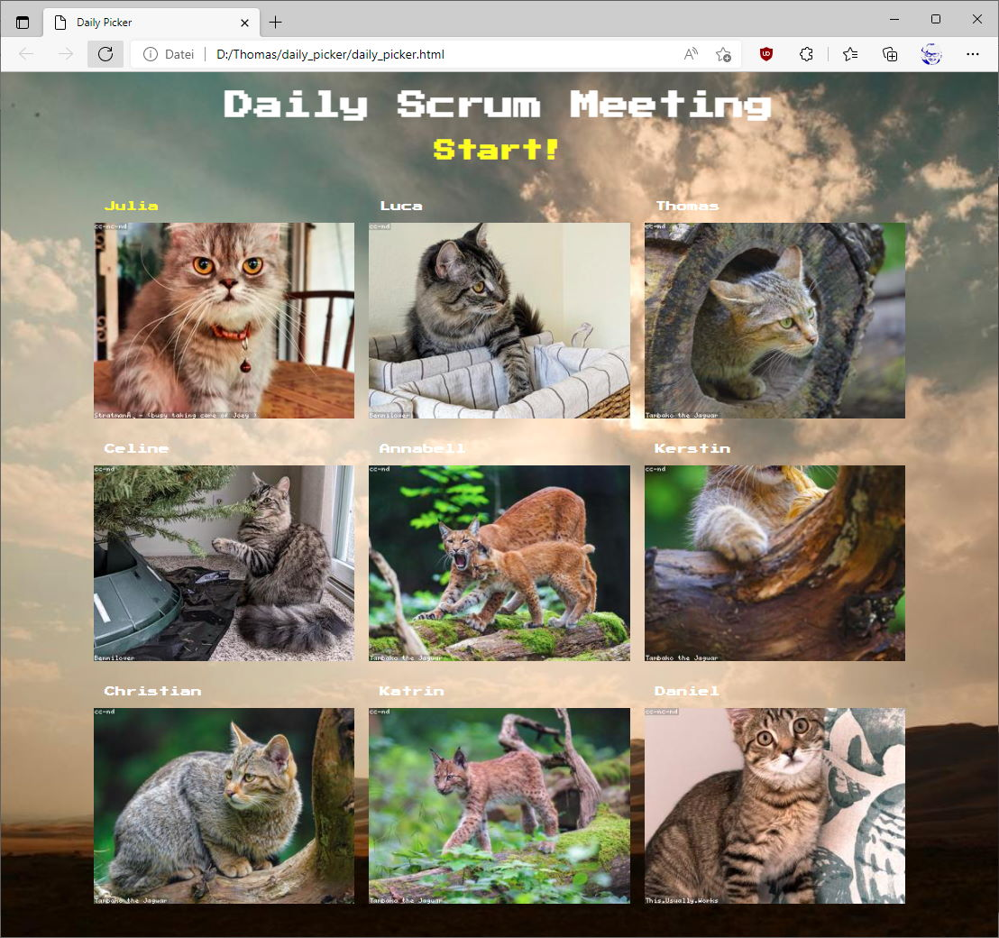

# Daily Picker
A simple html page to initiate the daily srum meeting.

# Features

* Randomly arrange the users 
* Randomly select a team member to start
* Click on team member to ignore from the daily.
* Click on "Start!" to begin the daily

# Used assets

* member images https://loremflickr.com
* background image https://picsum.photo

# How to use?
Just edit the the html page and update your team members. Feel free to adapt the colors, member images, background images, etc. ;)
